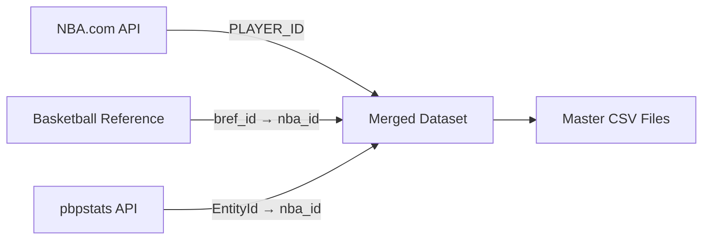

## Overview

The platform aggregates data from three complementary sources, each providing unique statistical coverage:

<CardGroup cols={3}>
  <Card title="NBA.com Stats API" icon="basketball">
    Official league tracking data and advanced metrics
  </Card>
  <Card title="Basketball Reference" icon="chart-line">
    Historical totals and per-possession statistics
  </Card>
  <Card title="pbpstats.com API" icon="code">
    Play-by-play derived metrics and on/off data
  </Card>
</CardGroup>

## NBA.com Stats API

### Overview

The official NBA statistics API provides tracking data, shooting metrics, and advanced analytics captured by SportVU cameras and official scorekeepers.

**Base URL**: `https://stats.nba.com/stats/`

### Available Endpoints

<AccordionGroup>
  <Accordion title="Hustle Statistics" icon="gauge">
    **Endpoint**: `leaguehustlestatsplayer`
    
    **Script**: `hustle.py:10-93`
    
    **Data Includes**:
    - Deflections and charges drawn
    - Screen assists and points created
    - Offensive and defensive loose balls recovered
    - Box outs (offensive/defensive)
    - Contested shots (2PT/3PT split)
    
    **Example Request**:
    ```python
    url = (
        'https://stats.nba.com/stats/leaguehustlestatsplayer'
        '?Season=2024-25&SeasonType=Regular%20Season'
        '&PerMode=Totals&LeagueID=00'
    )
    ```
  </Accordion>

  <Accordion title="Shooting by Defender Distance" icon="target">
    **Endpoint**: `leaguedashplayerptshot`
    
    **Script**: `player_shooting.py:65-122`
    
    **Data Includes**:
    - Field goal attempts and makes by defender proximity
    - Four distance categories:
      - Very Tight: 0-2 feet
      - Tight: 2-4 feet
      - Open: 4-6 feet
      - Wide Open: 6+ feet
    - 2PT/3PT shooting splits
    - Frequency percentages
    
    **Example Request**:
    ```python
    url = (
        'https://stats.nba.com/stats/leaguedashplayerptshot'
        '?CloseDefDistRange=6%2B%20Feet%20-%20Wide%20Open'
        '&Season=2024-25&SeasonType=Regular%20Season'
        '&PerMode=Totals'
    )
    ```
  </Accordion>

  <Accordion title="Dribble-Based Shooting" icon="dribble">
    **Endpoint**: `leaguedashplayerptshot` (DribbleRange parameter)
    
    **Script**: `dribble.py:13-77`
    
    **Data Includes**:
    - Shooting splits by dribbles before shot:
      - 0 Dribbles (catch & shoot)
      - 1 Dribble
      - 2 Dribbles
      - 3-6 Dribbles
      - 7+ Dribbles
    - Pull-up vs. catch & shoot classification
    - Jump shot analysis by dribbles
    
    **Example Request**:
    ```python
    url = (
        'https://stats.nba.com/stats/leaguedashplayerptshot'
        '?DribbleRange=3-6%20Dribbles'
        '&Season=2024-25&SeasonType=Regular%20Season'
        '&PerMode=Totals'
    )
    ```
  </Accordion>

  <Accordion title="Defensive Tracking" icon="shield">
    **Endpoint**: `leaguedashptdefend`
    
    **Script**: `defense.py:166-200`
    
    **Data Includes**:
    - Opponent field goal percentage when defending
    - Defensive field goals made/attempted
    - Frequency of defensive matchups
    - Rim protection (shots < 6 feet)
    - Normal vs. expected FG% differential
    
    **Example Request**:
    ```python
    url = (
        'https://stats.nba.com/stats/leaguedashptdefend'
        '?DefenseCategory=Overall'
        '&Season=2024-25&SeasonType=Regular%20Season'
        '&PerMode=Totals'
    )
    ```
  </Accordion>

  <Accordion title="Speed & Distance" icon="gauge-high">
    **Endpoint**: `leaguedashptstats`
    
    **Script**: `hustle.py:16-17`
    
    **Data Includes**:
    - Average speed (MPH)
    - Distance covered (miles)
    - Average seconds per touch
    - Average dribbles per touch
    - Points per touch
    
    **Example Request**:
    ```python
    url = (
        'https://stats.nba.com/stats/leaguedashptstats'
        '?PtMeasureType=SpeedDistance'
        '&Season=2024-25&SeasonType=Regular%20Season'
    )
    ```
  </Accordion>
</AccordionGroup>

### Authentication & Headers

<Warning>
  NBA.com Stats API requires specific headers to avoid 403 Forbidden errors.
</Warning>

Required headers for all requests:

```python
headers = {
    "Host": "stats.nba.com",
    "User-Agent": "Mozilla/5.0 (Windows NT 10.0; Win64; x64; rv:72.0) Gecko/20100101 Firefox/72.0",
    "Accept": "application/json, text/plain, */*",
    "Accept-Language": "en-US,en;q=0.5",
    "Accept-Encoding": "gzip, deflate, br",
    "Connection": "keep-alive",
    "Referer": "https://stats.nba.com/"
}

response = requests.get(url, headers=headers)
```

### Response Format

All NBA.com API endpoints return JSON with a consistent structure:

```json
{
  "resultSets": [
    {
      "name": "LeagueHustleStatsPlayer",
      "headers": ["PLAYER_ID", "PLAYER_NAME", "TEAM_ID", ...],
      "rowSet": [
        [1630162, "Precious Achiuwa", 1610612752, ...],
        [1628389, "Steven Adams", 1610612740, ...]
      ]
    }
  ]
}
```

Extract data with:

```python
json_data = response.json()
data = json_data["resultSets"][0]["rowSet"]
columns = json_data["resultSets"][0]["headers"]
df = pd.DataFrame(data, columns=columns)
```

### Rate Limiting

<Info>
  **Recommended delay**: 1-3 seconds between requests
  
  The NBA.com API does not publish official rate limits, but excessive requests may result in temporary IP blocks.
</Info>

```python
import time

for year in range(2014, 2026):
    df = get_hustle(year)
    df.to_csv(f'{year}/hustle.csv', index=False)
    time.sleep(2)  # 2-second delay
```

## Basketball Reference

### Overview

Basketball Reference provides comprehensive historical statistics via HTML tables. The platform uses web scraping with BeautifulSoup to extract data.

**Base URL**: `https://www.basketball-reference.com/`

### Available Pages

<Tabs>
  <Tab title="Per-Possession Stats">
    **URL Pattern**: `https://www.basketball-reference.com/leagues/NBA_{year}_per_poss.html`
    
    **Script**: `make_index.py:181-298`
    
    **Data Includes**:
    - Points, FGA, FTA per 100 possessions
    - True Shooting percentage
    - Player efficiency metrics
    - Team identification
    
    **Scraping Method**:
    ```python
    url = f"https://www.basketball-reference.com/leagues/NBA_2025_per_poss.html"
    response = requests.get(url, headers={'User-Agent': 'Mozilla/5.0'})
    soup = BeautifulSoup(response.text, 'html.parser')
    
    table = soup.find('table', id='per_poss_stats')
    rows = table.find('tbody').find_all('tr')
    ```
  </Tab>
  
  <Tab title="Season Totals">
    **URL Pattern**: `https://www.basketball-reference.com/leagues/NBA_{year}_totals.html`
    
    **Script**: `make_index.py:33-90`
    
    **Data Includes**:
    - Games played and minutes
    - Total FG, 3P, FT made/attempted
    - Total points
    - Player URLs for ID mapping
    
    **Extracting Player URLs**:
    ```python
    for row in rows:
        cells = row.find_all('td')
        if cells:
            player_cell = cells[0]
            player_name = player_cell.text
            player_url = "https://www.basketball-reference.com" + player_cell.a['href']
            
            # Extract Basketball Reference ID from URL
            # URL format: /players/j/jamesle01.html
            bref_id = player_url.split('/')[-1].replace('.html', '')
    ```
  </Tab>
  
  <Tab title="Playoffs">
    **URL Pattern**: `https://www.basketball-reference.com/playoffs/NBA_{year}_per_poss.html`
    
    **Script**: `make_index.py:34` (controlled by `ps` parameter)
    
    **Usage**:
    ```python
    def pull_bref(ps=False, totals=False):
        leagues = "playoffs" if ps else "leagues"
        url = f"https://www.basketball-reference.com/{leagues}/NBA_{year}_per_poss.html"
        # ... scraping logic
    
    # Get playoff data
    playoff_data = pull_bref(ps=True)
    ```
  </Tab>
</Tabs>

### Data Extraction with data-stat Attributes

Basketball Reference uses `data-stat` attributes for reliable cell identification:

```python
def get_stat_from_row(row_obj, stat_name, default_value="0"):
    """Extract stat using data-stat attribute."""
    cell = row_obj.find(['td', 'th'], {'data-stat': stat_name})
    if cell:
        text_content = cell.text.strip()
        return text_content if text_content else default_value
    return default_value

# Usage
player_name = get_stat_from_row(row, "player")
team = get_stat_from_row(row, "team_id")
fga = get_stat_from_row(row, "fga_per_poss")
pts = get_stat_from_row(row, "pts_per_poss")
```

Common `data-stat` values:
- `player` - Player name
- `team_id` - Team abbreviation
- `g` - Games played
- `mp` - Minutes played
- `fga_per_poss`, `fg_per_poss` - Field goals
- `fg3a_per_poss`, `fg3_per_poss` - Three-pointers
- `fta_per_poss`, `ft_per_poss` - Free throws
- `pts_per_poss` - Points per possession

### Player ID Mapping

Basketball Reference IDs are mapped to NBA.com IDs:

```python
# Extract Basketball Reference ID from URL
index_frame['bref_id'] = index_frame['url'].str.split('/', expand=True)[5]
index_frame['bref_id'] = index_frame['bref_id'].str.split('.', expand=True)[0]

# Map to NBA.com ID using master index
master = pd.read_csv('index_master.csv')
match_dict = dict(zip(master['bref_id'], master['nba_id']))
index_frame['nba_id'] = index_frame['bref_id'].map(match_dict)
```

### Rate Limiting

<Warning>
  Basketball Reference expects respectful scraping:
  
  - **Recommended delay**: 2-3 seconds between requests
  - Use proper `User-Agent` headers
  - Cache results to minimize repeat requests
</Warning>

```python
import time

frames = []
for year in range(2014, 2026):
    url = f"https://www.basketball-reference.com/leagues/NBA_{year}_per_poss.html"
    response = requests.get(url, headers={'User-Agent': 'Mozilla/5.0'})
    
    # Process data...
    
    time.sleep(3)  # 3-second delay
    print(f"Completed {year}")
```

## pbpstats.com API

### Overview

The pbpstats.com API provides play-by-play derived statistics including on/off data, lineup stats, and possession-level metrics.

**Base URL**: `https://api.pbpstats.com/`

### Available Endpoints

<AccordionGroup>
  <Accordion title="Player Totals" icon="user">
    **Endpoint**: `get-totals/nba`
    
    **Script**: `passing.py:15-48`
    
    **Parameters**:
    - `Season`: Format "2024-25"
    - `SeasonType`: "Regular Season" or "Playoffs"
    - `Type`: "Player" or "Team"
    
    **Data Includes**:
    - Offensive possessions
    - True shooting percentage
    - Points unassisted (2PT/3PT)
    - Assist breakdowns
    - Turnover details
    
    **Example Request**:
    ```python
    url = 'https://api.pbpstats.com/get-totals/nba'
    params = {
        "Season": "2024-25",
        "SeasonType": "Regular Season",
        "Type": "Player"
    }
    response = requests.get(url, params=params)
    data = response.json()["multi_row_table_data"]
    df = pd.DataFrame(data)
    ```
  </Accordion>

  <Accordion title="On/Off Statistics" icon="toggle-on">
    **Endpoint**: `get-on-off/nba/stat`
    
    **Script**: `defense.py:96-138`
    
    **Parameters**:
    - `Season`: Format "2024-25"
    - `SeasonType`: "Regular Season", "Playoffs", or "All"
    - `TeamId`: Team ID from pbpstats
    - `Stat`: Specific stat to query (e.g., "AtRimAccuracyOpponent")
    
    **Available Stats**:
    - `AtRimAccuracyOpponent` - Opponent FG% at rim
    - `AtRimFrequencyOpponent` - Frequency of opponent rim attempts
    - `FG2APctBlocked` - 2PT block percentage
    
    **Example Request**:
    ```python
    url = "https://api.pbpstats.com/get-on-off/nba/stat"
    params = {
        "Season": "2024-25",
        "SeasonType": "Regular Season",
        "TeamId": "1610612747",  # Lakers
        "Stat": "AtRimAccuracyOpponent"
    }
    response = requests.get(url, params=params)
    results = response.json()['results']
    ```
  </Accordion>

  <Accordion title="Team & Player Index" icon="list">
    **Endpoints**: 
    - `get-teams/nba`
    - `get-all-players-for-league/nba`
    
    **Script**: `defense.py:38-48`
    
    **Purpose**: Get team and player ID mappings for pbpstats API
    
    **Example**:
    ```python
    # Get team IDs
    teams_response = requests.get("https://api.pbpstats.com/get-teams/nba")
    teams = teams_response.json()['teams']
    team_dict = {team['text']: team['id'] for team in teams}
    # {'Los Angeles Lakers': '1610612747', ...}
    
    # Get player IDs
    players_response = requests.get(
        "https://api.pbpstats.com/get-all-players-for-league/nba"
    )
    players = players_response.json()["players"]
    player_dict = {player.lower(): num for num, player in players.items()}
    ```
  </Accordion>
</AccordionGroup>

### Response Format

The pbpstats API returns JSON with player/team data:

```json
{
  "multi_row_table_data": [
    {
      "EntityId": "1629029",
      "Name": "Luka Doncic",
      "Minutes": 2456,
      "Points": 2156,
      "Assists": 654,
      "TsPct": 0.589,
      "OffPoss": 5234,
      ...
    }
  ]
}
```

### Merging with NBA.com Data

The passing script demonstrates multi-source merging:

```python
# pbpstats totals
response = requests.get('https://api.pbpstats.com/get-totals/nba', params=params)
df = pd.DataFrame(response.json()["multi_row_table_data"])
df.rename(columns={'EntityId': 'PLAYER_ID'}, inplace=True)

# NBA.com passing data
df2 = pd.read_csv('tracking/passing.csv')
df2 = df2[df2.year == year]

# NBA.com touches data  
df3 = pd.read_csv('tracking/touches.csv')
df3 = df3[df3.year == year]

# Merge on NBA player ID
df['nba_id'] = df['PLAYER_ID'].astype(int)
df2['nba_id'] = df2['PLAYER_ID'].astype(int)
df3['nba_id'] = df3['PLAYER_ID'].astype(int)

merged = df.merge(df2, on='nba_id', how='left')
merged = merged.merge(df3, on='nba_id', how='left')
```

### Rate Limiting

<Info>
  **Recommended delay**: 3 seconds between requests, especially in team loops
  
  The pbpstats API is community-maintained and should be used respectfully.
</Info>

```python
import time

for team in team_dict.keys():
    params = {
        "Season": "2024-25",
        "TeamId": team_dict[team],
        "Stat": "AtRimAccuracyOpponent"
    }
    response = requests.get(url, params=params)
    
    # Process...
    
    time.sleep(3)  # 3-second delay per team
```

## Data Integration Strategy

The platform combines all three sources:



### Common Identifiers

| Source | ID Field | Example | Format |
|--------|----------|---------|--------|
| NBA.com | `PLAYER_ID` | 2544 | Integer |
| Basketball Reference | `bref_id` | jamesle01 | String |
| pbpstats | `EntityId` | 2544 | String (converts to int) |

The `index_master.csv` file maintains mappings:

```csv
player,bref_id,nba_id,team,team_id,year,url
LeBron James,jamesle01,2544,LAL,1610612747,2025,https://www.basketball-reference.com/players/j/jamesle01.html
```

## Best Practices

<CardGroup cols={2}>
  <Card title="Always Use Headers" icon="shield">
    Include proper User-Agent and Referer headers for all API requests
  </Card>
  <Card title="Respect Rate Limits" icon="clock">
    Implement delays between requests (2-3 seconds recommended)
  </Card>
  <Card title="Cache Results" icon="database">
    Save responses locally to avoid redundant requests
  </Card>
  <Card title="Error Handling" icon="triangle-exclamation">
    Implement try/except blocks for network issues and missing data
  </Card>
</CardGroup>

## Next Steps

<Card title="API Scripts Reference" icon="code" href="/api/make-index">
  Explore detailed documentation for each data collection script
</Card>
